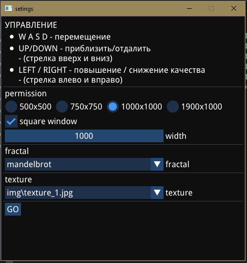
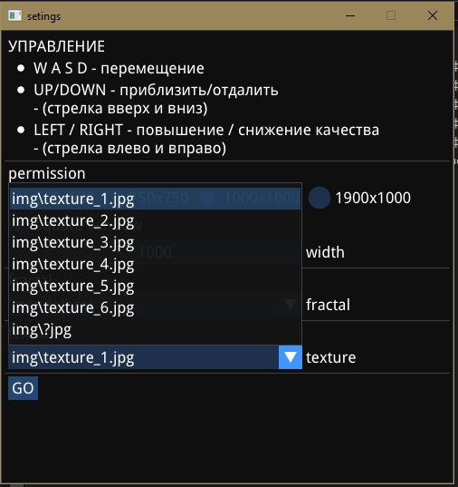
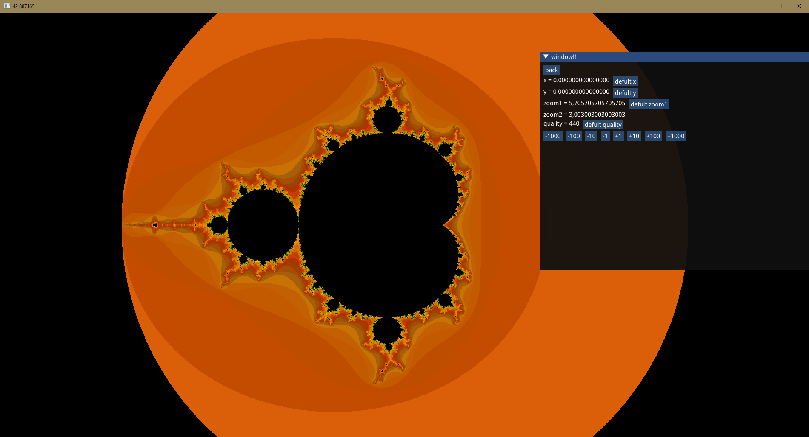
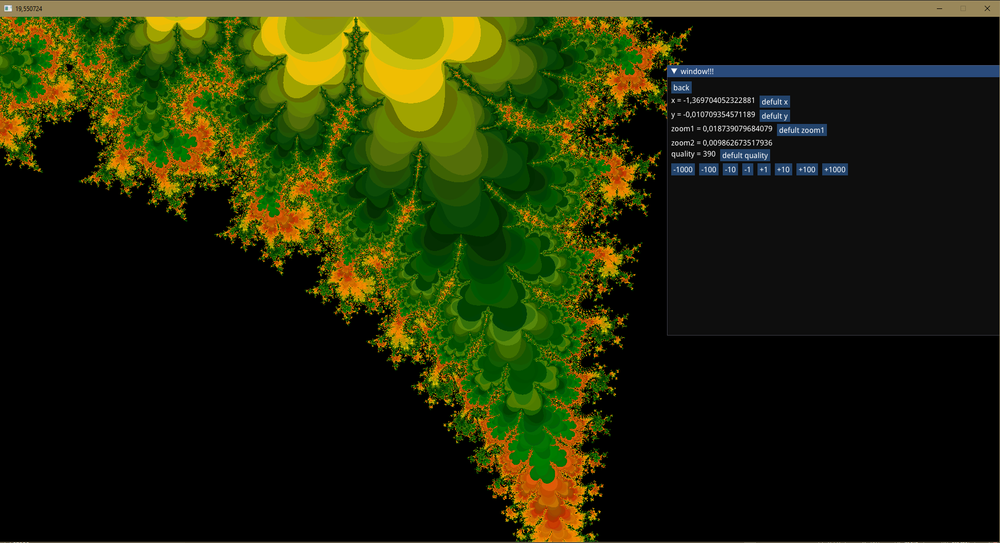

# Fractal

Интерактивный исследователь 2D-фракталов

> 🌀 Реализованы классические и нестандартные фракталы с плавным зумированием и настройкой визуализации

### Особенностяи

- Поддержка популярных фракталов: Mandelbrot, Julia, Burning Ship и др.
- Плавный зум и перемещение: Гибкое управление камерой (мышь, клавиатура)
- Гибкие настройки:
  - Изменение цветовых палитр
  - Настройка детализации и итераций
  - Экспорт изображений в высоком разрешении
- Оптимизация: OpenCL для быстрых вычислений на GPU

## 🔹 Оглавление

- [Технологии](#-технологии)
- [Функциональность](#-функциональность)  
- [Установка и запуск](#️-установка-и-запуск)  
- [Примеры использования](#-примеры-работы)  
- [Планы по доработке](#-планы-по-доработке)  

## 🛠 Технологии  

- **C++** (основной язык разработки)
- **ImGui** (графический интерфейс)
- **SFML** (рендеринг и управление окнами/вводом)
- **OpenCL** (вычисления на GPU)

## 🚀 Функциональность

### 🖥 Графический интерфейс

- Удобное управление через ImGui
- Настройка параметров в реальном времени

### � Рендеринг и обработка

- Рендеринг кадра при помощи OpenCL

### ⚡ Производительность

- Оптимизированные вычисления на GPU

## ⚙️ Установка и запуск

> Инструкции будут добавлены позже.

## 📸 Примеры работы

  
  
  

  
  

